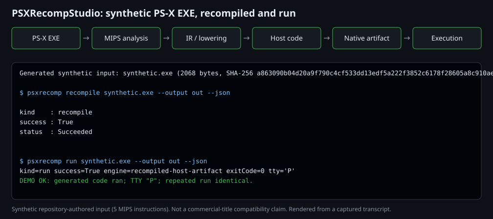

# Synthetic Showcase Demo

**Status:** Experimental

**Authority:** Reference

**Related Issues:** #505, #624

**Related Components:** `scripts/demo/synthetic-demo.ps1`, `docs/assets/demo/`, `src/PSXRecomp.Tests/E2E/GeneratedPsxExeFixtures.cs`

A reproducible walk through the current pipeline using **only synthetic input**:

```text
synthetic PS-X EXE -> psxrecomp recompile -> generated host artifact -> psxrecomp run -> deterministic result
```

This is a proof that the pipeline works end to end on a five-instruction
repository-authored program. It is **not** a compatibility claim: complete
commercial PS1 titles are not recompilable today (see the README limitations).

## The input

The script generates the PS-X EXE at run time; nothing is committed (the
[artifact policy](artifact-policy.md) forbids any PS-X EXE in the tree). The
bytes are identical to the `bios-putchar-marker` fixture in
`GeneratedPsxExeFixtures` (SHA-256
`a863090b04d20a9f790c4cf533dd13edf5a222f3852c6178f28605a8c910ae6e`, checked by
the script). The program calls BIOS `putchar('P')` through the A0 vector, sets
`$s1 = 0x7777`, and runs off the end of the image.

## Run it

Prerequisites: PowerShell 7 (`pwsh`) and `gcc` on `PATH` (the generated-host
build invokes it), plus either a [released `psxrecomp`](https://github.com/mao2009/PSXRecompStudio/releases/latest) or the .NET SDK to build from source.

```bash
# From a release binary
pwsh scripts/demo/synthetic-demo.ps1 -Psxrecomp ./psxrecomp

# From source (builds the CLI in Release)
pwsh scripts/demo/synthetic-demo.ps1
```

The script writes into a temp directory (`-WorkDir` to override), runs
`recompile`, then runs `run --json` twice, and exits `0` only if the run
succeeded on the `recompiled-host-artifact` engine, the guest wrote exactly
`P` to the TTY, and both runs produced identical JSON.

## Expected output

Committed as [`docs/assets/demo/synthetic-demo-output.txt`](../assets/demo/synthetic-demo-output.txt)
(captured from a real run of the script):

```text
Generated synthetic input: synthetic.exe (2068 bytes, SHA-256 a863090b04d20a9f790c4cf533dd13edf5a222f3852c6178f28605a8c910ae6e)

$ psxrecomp recompile synthetic.exe --output out --json

kind    : recompile
success : True
status  : Succeeded


$ psxrecomp run synthetic.exe --output out --json
kind=run success=True engine=recompiled-host-artifact exitCode=0 tty='P'
DEMO OK: generated code ran; TTY "P"; repeated run identical.
```

## Verified against a published release

The script was run against the released Windows binary
`psxrecomp-v0.0.0-alpha.2-win-x64.zip` (the latest release when checked,
2026-09-29; archive checked against the release `SHA256SUMS.txt`) with
`pwsh scripts/demo/synthetic-demo.ps1 -Psxrecomp <path>\psxrecomp.exe` and `gcc`
(MinGW-w64) on `PATH`. It exited `0`, and its output was identical to the
committed capture above, including `engine=recompiled-host-artifact` and TTY
`P`. The Linux and macOS archives were not run for this check.

## Visual asset



[`docs/assets/demo/synthetic-demo.svg`](../assets/demo/synthetic-demo.svg) (about 4 KB, text) shows the
pipeline stages above the captured terminal output. It is **rendered, not
recorded**: `scripts/demo/render-showcase-svg.ps1` turns a transcript into the
SVG with no timestamps or embedded fonts, so the same transcript always gives
byte-identical output. The committed transcript was produced by the demo script
and matches the run against the published `v0.0.0-alpha.2` binary above.

```bash
pwsh scripts/demo/synthetic-demo.ps1 -Psxrecomp ./psxrecomp *> transcript.txt
pwsh scripts/demo/render-showcase-svg.ps1 -Transcript transcript.txt -Out synthetic-demo.svg
```

No video is committed (binary size policy, see the [artifact policy](artifact-policy.md)).
If you want a live recording, record the first command in any local tool and keep
it out of the repository; do not include any ROM, BIOS, or commercial-title footage.

## Reusing it in announcements

GitHub, Reddit, Bluesky, DEV.to, or similar posts can use the SVG (convert to
PNG with any tool if the site rejects SVG) plus the copy below. Keep the
limitation sentence.

> PSXRecompStudio is a research-stage PS1 static recompiler. Given a tiny
> synthetic PS-X EXE (generated by the script, no ROM/BIOS needed), the CLI
> recompiles it to a native host artifact and runs it: `psxrecomp recompile`,
> then `psxrecomp run`. Reproduce it from the latest release with
> `pwsh scripts/demo/synthetic-demo.ps1 -Psxrecomp ./psxrecomp`.
> Limitation: complete commercial PS1 titles are not recompilable yet; this is a
> five-instruction proof of the pipeline, not a compatibility claim.
> https://github.com/mao2009/PSXRecompStudio

Suggested asset names: `psxrecomp-synthetic-demo.svg` (image) and
`psxrecomp-synthetic-demo-transcript.txt` (text).

## Not covered

Real-title input, `--report` diagnostic bundles, and CHD input are documented in
the [headless CLI reference](headless-cli.md).
